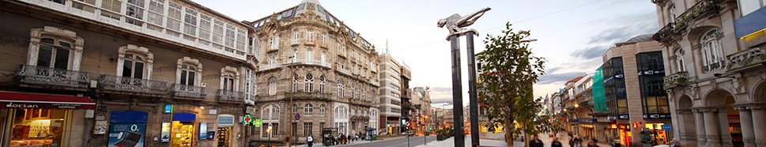
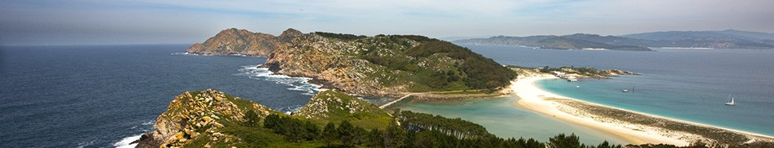
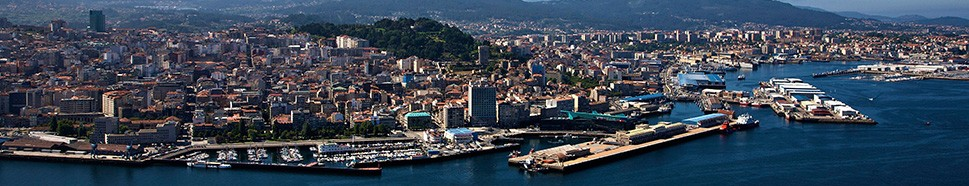

This marine city with a tireless and enterprising spirit combines its vibrant urban life with one of the most beautiful landscapes in Galicia: the Cíes Islands are a real must for all those travelling to the north of Spain, as a couple, with friends or the whole family. This is the ideal destination for nature lovers in southern Galicia; come to the heart of the Vigo estuary, a place with fabulous beaches, as well as a diverse nightlife, culture, shopping and entertainment offer for everyone... and every budget.

Vigo is designed for those seeking a wide selection of options: Galician cuisine, nature, sailing, beaches, leisure and the liveliest nightlife in Galicia.

Vigo is full of surprises. It's one of the essential **urban tourism** destinations in northern Spain and the largest city in Galicia. The best thing about a **holiday in Vigo** is the vast selection of leisure services and options at your disposal. In addition to its wonderful natural environment, the famous [Vigo beaches](http://www.turismodevigo.org/en/node/1721) and the [Cies Islands](http://www.turismodevigo.org/en/node/1807), you'll discover a genuine industrial, dynamic, entrepreneurial and trend-setting city.

Vigo is a city with character that combines tradition and innovation in its particular idiosyncrasy, offering a wide range of possibilities. You can dive into the streets of [Old Town Vigo](http://www.turismodevigo.org/en/node/774) or spend a morning shopping, browsing the [weekly outdoor markets](http://www.turismodevigo.org/en/node/1078) set up in the [neighbourhoods](http://www.turismodevigo.org/en/node/1060). Other options are hiking a nature trail in the heart of the city, in [monte de O Castro](http://www.turismodevigo.org/en/node/1102), discovering a spectacular [campus](http://www.turismodevigo.org/en/node/1167), enjoying a first division football match or discovering a historic industry dedicated to fishing, the motor world and innovation.

In short, you have come to a unique city bursting with life. But be sure to leave all stereotypes behind... because Vigo is different from any other city.

## A sea of life

Welcome to Paradise: **Vigo** is the perfect city for **active tourism**. Don't be fooled by its industrial feel, Vigo's **natural environment** is unique and incomparable. There's a belt of forest parks surrounding the city that makes it ideal for **hiking** and **biking routes**. You'll be amazed by the views of the [Vigo Estuary](http://www.turismodevigo.org/en/node/2306), seen from the highest points of our mountains. You'll find fountains, rivers, streams, and even reservoirs for the **fishing** season. They all flow into our **beaches**, where you can **surf, windsurf or kite surf**; even in the centre, you can immerse yourself in nature by climbing the **[O Castro Mountai](http://www.turismodevigo.org/en/node/1102)n** and jogging or practicing **athletics** in **Castrelos Park**.

The [**Cíes Islands**](http://www.turismodevigo.org/en/node/1807), located in the [**Vigo Estuary**](http://www.turismodevigo.org/en/node/2306)and part of the *Parque Nacional Illas Atlánticas* (**[Atlantic Islands National Park](http://www.turismodevigo.org/en/node/2336)**), are a paradise of white sand **beaches** and clear waters. This is a stunning natural environment where you can enjoy **hiking, diving, anchoring your boat** or simply strolling by the sea.

The **Cíes Islands** are the **Vigo estuary's greatest treasure**: an amazing national marine-terrestrial park and one of the country's most beautiful places, which is why the Romans named them the *islands of the gods*.

The Cíes archipelago is made up of three islands: Monte Agudo, O Faro and San Martiño. The first two are connected by a long strip of sand: [Rodas Beach](http://www.turismodevigo.org/en/node/2394), **the best beach in the world**, according to [*The Guardian*](http://www.guardian.co.uk/travel/2007/feb/16/beach.top10).

The Cíes are part of the **Atlantic Islands National Park**, a beach paradise with crystalline waters, in a natural environment that makes it a unique wildlife observatory.

A **visit to the Cíes** is ideal for hiking with your family or for a getaway in search of quiet and **unspoilt beaches**. You can take a day [boat trip to the Cíes](http://www.turismodevigo.org/en/node/2348) or rent a yacht in Vigo. Or, if you prefer, spend a **weekend camping in the Cíes Islands**. It's also a great place for [diving in the Vigo estuary](http://www.turismodevigo.org/en/node/2333) and, with a bit of luck, you can swim surrounded by *arroaces* (native, smaller sized dolphins).

## More information

- [City tourism office visitor information](http://www.turismodevigo.org/en)
- [Wikipedia page](https://en.wikipedia.org/wiki/Vigo)
